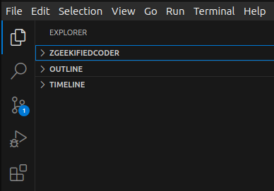

### 1. Core Technologies

**HTML, CSS, and JavaScript** are the core technologies that form the foundation of web development. These are used to create the front end of **websites**. Frameworks like **React, Angular, etc.** are built on top of these core technologies (*especially JavaScript*) to simplify and enhance the development process.

---

### 2. Purpose of these Technologies  

#### **HTML:**  
Provides the basic structure of a website, forming the backbone necessary for functionality. Examples of elements include:  
- Text,  
- Buttons,  
- Links,  
- Images,  
- and other structural components.

#### **CSS:**  
Responsible for styling the contents (HTML elements) of the website. CSS allows you to define:  
- **Positioning:** Where elements appear on the page.  
- **Typography:** Font size, font style, and more.  
- **Colors:** Text color, background color, link color, etc.  
- **Visual Design:** Styling for headings, borders, spacing, animations, and responsiveness.  

#### **JavaScript:**  
Adds interactivity and dynamic behavior to web pages. JavaScript is responsible for:  
- Making web pages interactive (e.g., dropdown menus, modals, sliders).  
- Validating user inputs (e.g., forms).  
- Fetching and updating data dynamically without refreshing the page (e.g., via APIs or AJAX).  
- Implementing complex logic for animations and transitions.  
- Enhancing user experiences with features like drag-and-drop or infinite scrolling.  

--- 

Let me know if further refinement is needed!### 1. Core Technologies

**HTML, CSS, and JavaScript** are the core technologies that form the foundation of web development. These are used to create the front end of **websites**. Frameworks like **React, Angular, etc.** are built on top of these core technologies (*especially JavaScript*) to simplify and enhance the development process.

---

### 2. Purpose of these Technologies  

#### **HTML:**  
Provides the basic structure of a website, forming the backbone necessary for functionality. Examples of elements include:  
- Text,  
- Buttons,  
- Links,  
- Images,  
- and other structural components.

#### **CSS:**  
Responsible for styling the contents (HTML elements) of the website. CSS allows you to define:  
- **Positioning:** Where elements appear on the page.  
- **Typography:** Font size, font style, and more.  
- **Colors:** Text color, background color, link color, etc.  
- **Visual Design:** Styling for headings, borders, spacing, animations, and responsiveness.  

#### **JavaScript:**  
Adds interactivity and dynamic behavior to web pages. JavaScript is responsible for:  
- Making web pages interactive (e.g., dropdown menus, modals, sliders).  
- Validating user inputs (e.g., forms).  
- Fetching and updating data dynamically without refreshing the page (e.g., via APIs or AJAX).  
- Implementing complex logic for animations and transitions.  
- Enhancing user experiences with features like drag-and-drop or infinite scrolling.  

### **React, Angular, etc.:**

These are **JavaScript frameworks and libraries** built on top of the core web technologies (**HTML, CSS, and JavaScript**) to streamline and enhance the development process. They provide:  

- **Predefined Components:** Ready-to-use building blocks like buttons, modals, and forms that save time and ensure consistency.  
- **Reusable Code:** Component-based architecture enables reusing code across different parts of the application.  
- **State Management:** Simplifies handling and sharing data between various parts of an application.  
- **Routing:** Efficient navigation between pages or views without reloading the page.  
- **Enhanced Performance:** Optimized rendering using techniques like virtual DOM (React) or two-way data binding (Angular).  
- **Tooling and Ecosystem:** Tools like CLI (Command Line Interface) for scaffolding projects, debugging, and testing.

By leveraging these frameworks and libraries, developers can build more complex and dynamic applications with less repetitive code and greater efficiency.

--- 

/home/sanju/Pictures/

{ width=300px }

