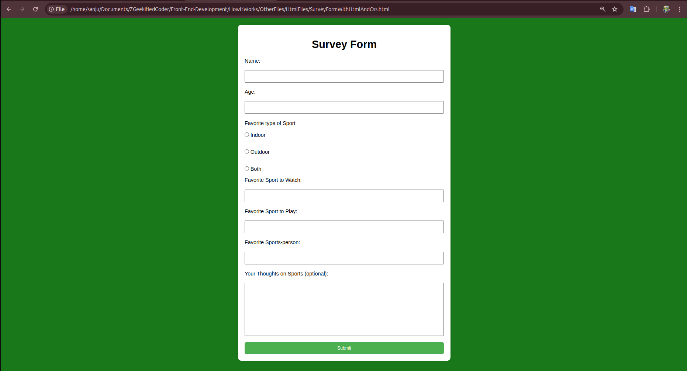

### 1. Core Technologies

**HTML, CSS, and JavaScript** are the core technologies that form the foundation of website and website development (in short web-development). These are used to create the front end of **websites**. Frameworks like **React, Angular, etc.** are built on top of these core technologies (*especially JavaScript*) to simplify and enhance the development process.

#### Analogy
- **HTML**: The foundation or skeleton of a building *(i.e, website)*.
- **CSS**: The paint, decorations, and furnishings that make the building look attractive and functional *(like font size, color, types, etc)*.
- **JavaScript**: The systems and gadgets (e.g., elevators, lights, smart devices) that make the building interactive and user-friendly *(like loading contents with in the page, without websites reloading)*.

---

### 2. Specific Purpose of these Technologies (HTML, CSS, JS)

#### **HTML:**  
Provides the base structure of a website, forming the backbone necessary for functionality. Examples of **HTML** functionalities include:  
- Text,  
- Buttons,  
- Links,  
- Images,  
- and other structural components, etc.

#### **CSS:**
**CSS** is a technology used to style and visually present the content defined by HTML. It controls the layout, colors, fonts, spacing, and overall aesthetic of a webpage, making it visually appealing and user-friendly. CSS allows you to define things like:  
- **Positioning:** Where elements appear on the page.  
- **Typography:** Font size, font style, and more.  
- **Colors:** Text color, background color, link color, etc.  
- **Visual Design:** Styling for headings, borders, spacing, animations, and responsiveness.  

#### **JavaScript:**  
JavaScript is a programming language that adds interactivity and dynamic behavior to a website. JavaScript is responsible for:  
- Making web pages interactive (e.g., dropdown menus, modals, sliders).  
- Validating user inputs (e.g., forms).  
- Fetching and updating data dynamically without refreshing the page (e.g., via APIs or AJAX).  
- Implementing complex logic for animations and transitions.  
- Enhancing user experiences with features like drag-and-drop or infinite scrolling.  

### **React, Angular, etc.:**

These are **JavaScript frameworks and libraries** built on top of the core web technologies (**HTML, CSS, and JavaScript**) to streamline and enhance the development process. They provide:  

- **Predefined Components:** Ready-to-use building blocks like buttons, modals, and forms that save time and ensure consistency.  
- **Reusable Code:** Component-based architecture enables reusing code across different parts of the application.  
- **State Management:** Simplifies handling and sharing data between various parts of an application.  
- **Routing:** Efficient navigation between pages or views without reloading the page.  
- **Enhanced Performance:** Optimized rendering using techniques like virtual DOM (React) or two-way data binding (Angular).  
- **Tooling and Ecosystem:** Tools like CLI (Command Line Interface) for scaffolding projects, debugging, and testing.

By leveraging these frameworks and libraries, developers can build more complex and dynamic applications with less repetitive code and greater efficiency.

---

### how websites work in order ( HTML, CSS, JS ):
- website should be developed ads will be in the below order  
    - 1. **HTML** is the core script *(technology)* needed for website to work. Without **HTML** there is no way for wbesites to work.
    - 2. **CSS and JavaSacript *(JS)*** are the technologies that just makes the website look good,  interactable, etc. Here:
        - **css** is a styling langauge, 
        - but **JavaScript** *(JS)* is a programming a language.

### How Websites looks
I have choosen a Survey website Form as an example *(you can view all the source file inside folders 'HtmlFiles', 'CssFiles', 'JsFiles' in the directory 'HowItWorks/OtherFiles')*
- #### With Only HTML
    
- #### With HTML and CSS
    
- #### with HTML, CSS, JavaScript
    you wont be able to find much difference with JavaScript Until you interact with an actual website with JavaScript.

    

### Summary
- HTML forms the **core** structure of an website.
- CSS defines the **style** and **visual presentation**.
- JavaScript provides **behavior** and **interactivity**.

--- 